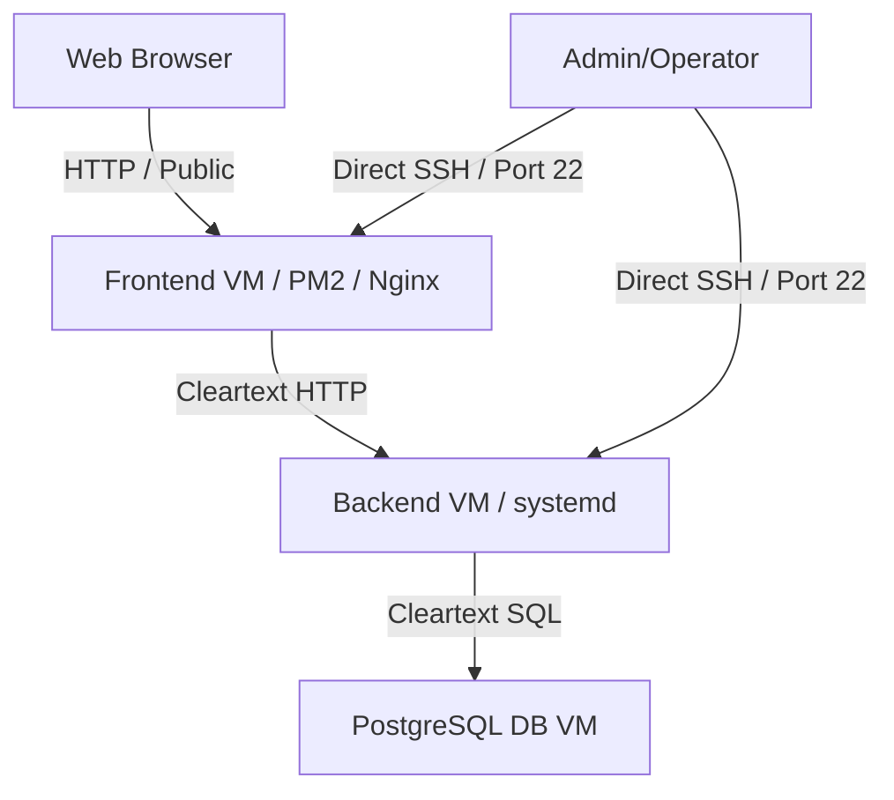
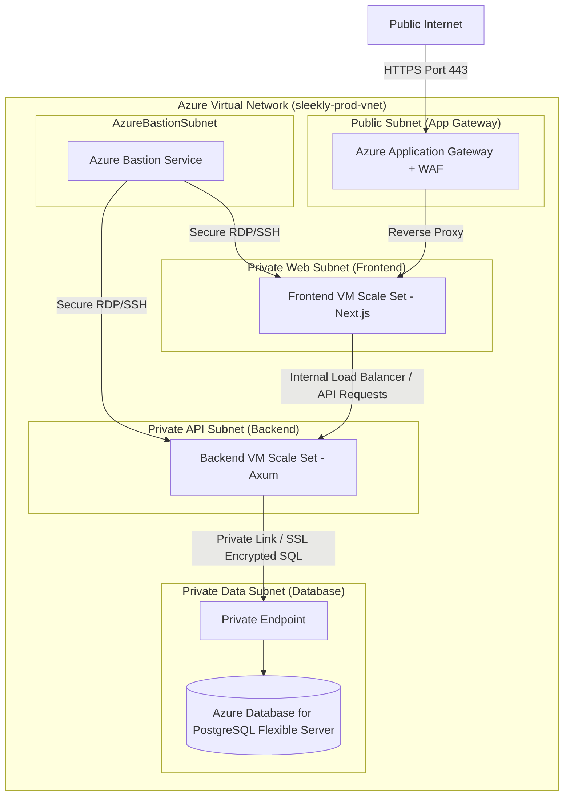
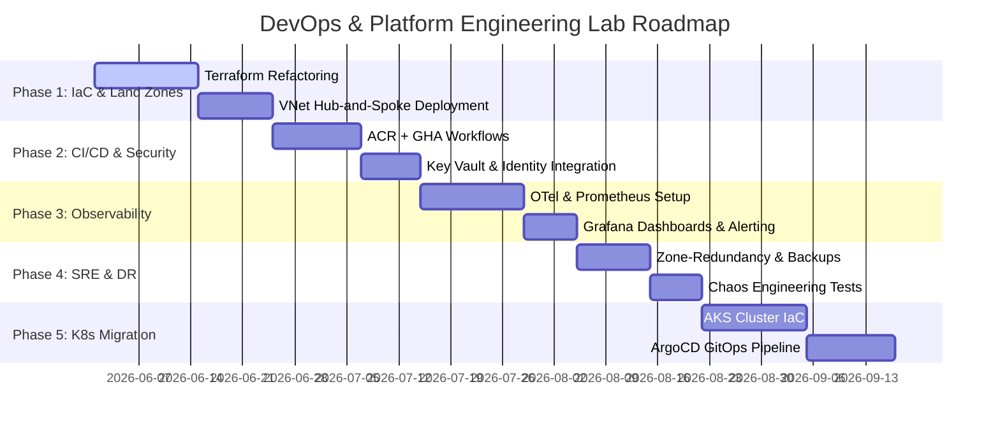

# DevOps and Platform Engineering Learning Lab Roadmap: Sleekly 3-Tier

This document evaluates the current architecture of the **Sleekly 3-Tier** application and provides a detailed roadmap to transform it into a production-grade DevOps and Platform Engineering learning environment. It details cloud architecture, secure networking, infrastructure-as-code, observability, SRE practices, CI/CD pipelines, security hardening, and Kubernetes migration.

---

## 🔍 Part 1: Current Architecture Evaluation & Gaps

The current `cardcanvas-3-tier` (now `sleekly-3-tier`) codebase is a traditional three-tier web application consisting of a Next.js frontend, an Axum Rust backend, and a PostgreSQL database. While functional, the current deployment scripts, Terraform configs, and local docker setups contain several structural limitations:

### Critical Gaps for Production Deployments:
*   **Security Gaps**:
    *   **Direct Public SSH (Port 22)**: VMs are exposed directly to the internet for deployment scripts.
    *   **Insecure Secrets Management**: Credentials, database passwords, and JWT keys are stored in plain-text `.env` templates or configuration files.
    *   **Lack of TLS/SSL**: Nginx configuration files contain placeholders but lack automated Certbot/SSL certificates, letting HTTP traffic pass in the clear.
    *   **Cleartext Backend Communication**: Traffic between the Frontend VM, Backend VM, and PostgreSQL database passes unencrypted over standard ports.
*   **Availability & Reliability Gaps**:
    *   **Single Points of Failure (SPOF)**: Single VMs for the frontend, backend, and database. No auto-scaling, load balancing, or failover configuration.
    *   **No Offsite Backups**: A simple bash script (`scripts/backup.sh`) backs up database files locally, leaving the application vulnerable to regional VM disk failures.
*   **Observability & Monitoring Gaps**:
    *   **Standard Out Logging**: Logs are written to simple file targets (`/var/log/sleekly-backend/out.log`) without log aggregation, indexing, metric generation, or alerting rules.
*   **Manual Deployments**:
    *   Deployments use local bash scripts that require direct SSH keys and VM IP addresses. This does not align with GitOps or modern automated CI/CD practices.

---

## 🏛️ Part 2: Target Enterprise Cloud Architecture (Azure)

The target architecture transitions the application into a secure, high-availability virtual network spanning private subnets, managed databases, load balancers, and a secure Bastion connection.

### 1. Networking Infrastructure (Hub-and-Spoke & Private Links)
*   **Azure Virtual Network (VNet)**: Segregated into four distinct subnets:
    1.  `AppGatewaySubnet` (Public): Only exposes public HTTPS (Port 443) traffic.
    2.  `AzureBastionSubnet` (Private): Dedicated subnet for secure administrative access.
    3.  `FrontendSubnet` (Private): Hosts the Next.js VMs. No public IP addresses.
    4.  `BackendSubnet` (Private): Hosts the Rust Axum APIs. Accessible only from the frontend subnet.
    5.  `DatabaseSubnet` (Private): Contains Private Endpoints for the PostgreSQL instance.
*   **Network Security Groups (NSGs)**: Rigid ingress/egress rules enforcing the principle of least privilege:
    *   *Frontend Subnet Ingress*: Accept traffic ONLY from the Application Gateway on port `3000`.
    *   *Backend Subnet Ingress*: Accept traffic ONLY from the Frontend Subnet on port `8080`.
    *   *Database Subnet Ingress*: Accept traffic ONLY from the Backend Subnet on port `5432`.
    *   *Block All SSH (Port 22)*: Except through the Azure Bastion subnet IP range.

### 2. High Availability (HA) & Load Balancing
*   **Azure Application Gateway**: Acts as a Layer 7 Load Balancer, providing:
    *   SSL/TLS termination (using certificates stored in Azure Key Vault).
    *   Web Application Firewall (WAF v2) to protect against OWASP Top 10 exploits.
*   **Virtual Machine Scale Sets (VMSS)**:
    *   Deploy frontend and backend VMs across multiple availability zones.
    *   Autoscaling rules based on CPU and memory usage metrics.

### 3. Managed Database Tier
*   **Azure Database for PostgreSQL (Flexible Server)**:
    *   Configured with High Availability (Zone-Redundant).
    *   Private Link Integration ensures all database traffic remains inside the Azure backbone network.
    *   Storage auto-growth and geo-redundant backups enabled.

### 4. Configuration and Secrets Management
*   **Azure Key Vault**: Stores all secrets, including the database passwords, JWT signing keys, and SSL certificates.
*   **Managed Identities**: Frontend and backend VMs run under system-assigned managed identities, letting them query Azure Key Vault directly for credentials at startup without hardcoded access tokens.

---

## 🚀 Part 3: Production DevOps Roadmap

We will divide this transformation into 5 clear phases to create a production-ready system.

### Phase 1: Infrastructure-as-Code (Terraform & Landing Zone)
*   **Refactor Terraform Structure**:
    *   Split the current single-file configuration into a modular design (`modules/networking`, `modules/compute`, `modules/database`, `modules/security`).
    *   Implement **Remote State Management** using an Azure Blob Storage container with lease locking enabled.
*   **Implement Azure Landing Zone**:
    *   Define Hub-and-Spoke network topology using peer-to-peer VNet links.
    *   Deploy **Azure Bastion** to allow SSH over HTTPS without exposing public ports.
    *   Deploy Azure Key Vault to store secrets, integrating it with the VM environments.

### Phase 2: Enterprise CI/CD Pipeline
*   **Implement GitHub Actions Workflows**:
    *   Create two pipelines: one for `sleekly-backend` and one for `sleekly-frontend`.
    *   **Build & Push**: Build Docker images locally and push them to **Azure Container Registry (ACR)**.
    *   **Vulnerability Scanning**: Scan images during the build phase using **Trivy** or **Aqua MicroScanner**.
    *   **Deployment**: Deploy to virtual machine clusters or scale sets using blue-green deployment strategies to ensure zero downtime.

### Phase 3: Observability, Logging, & SRE Practices
*   **OpenTelemetry Integration**:
    *   Instrument the Axum backend using OpenTelemetry trace providers to track latency and runtime statistics.
    *   Instrument the Next.js frontend with client-side telemetry trackers.
*   **Observability Stack (Prometheus + Grafana + Loki)**:
    *   Deploy Prometheus collectors to query JVM/VM metrics.
    *   Deploy Promtail / Loki on VM instances to parse and forward structured JSON logs.
    *   Build Grafana dashboards monitoring SRE Golden Signals (Latency, Traffic, Errors, Saturation).
*   **Alerting**:
    *   Configure Discord or Slack notifications for HTTP 5xx spikes, high CPU usage, and database connection limits.

### Phase 4: SRE Operations, Disaster Recovery, & Backups
*   **Backups**:
    *   Enable PostgreSQL geo-redundant backups with a 35-day retention window.
    *   Set up Azure Recovery Services vault to capture daily VM system snapshots.
*   **Disaster Recovery Plan**:
    *   Create a secondary cold-standby deployment in a secondary Azure region.
    *   Create automated Terraform scripts to stand up the secondary environment if a regional outage occurs.

### Phase 5: Cloud-Native Migration Path (Kubernetes & GitOps)
*   **Azure Kubernetes Service (AKS)**:
    *   Migrate VM configurations into AKS.
    *   Develop **Helm Charts** for `sleekly-frontend` and `sleekly-backend`.
*   **GitOps Pipeline (ArgoCD)**:
    *   Deploy ArgoCD inside the AKS cluster.
    *   Define a GitOps repository containing Kubernetes manifests (Deployments, Services, ingress-nginx, Cert-manager, ExternalDNS).
    *   Enable automatic synchronization so that updates in git automatically deploy to the cluster.
*   **Autoscaling with KEDA**:
    *   Configure KEDA (Kubernetes Event-driven Autoscaling) to scale pod counts based on real-time HTTP traffic volumes.

---

## 📋 Part 4: Production Checklist

Below is the production readiness checklist that defines success for this platform engineering lab:

| Category | Requirement | Verification Method |
| :--- | :--- | :--- |
| **Networking** | All backend VMs are hosted in private subnets with no public IPs. | Verify via Azure Portal or CLI that only the Application Gateway has a public IP. |
| **Security** | Secrets are fetched dynamically from Azure Key Vault using Managed Identities. | Verify no plain-text credentials exist in the git repository or VM environment configuration files. |
| **Access Control** | SSH is disabled on public ports; access is restricted to Azure Bastion. | Run an Nmap scan against VM public IPs; confirm port 22 is blocked. |
| **Observability** | Latency, traffic volume, errors, and saturation are tracked in Grafana. | Simulate a load test and confirm the metrics populate the dashboards. |
| **CI/CD** | Commits to `main` compile, scan, and deploy automatically without manual SSH commands. | Trigger a GitHub Action and verify successful deployment. |
| **High Availability** | The application remains online if a frontend or backend VM fails. | Terminate a VM instance and verify the load balancer redirects traffic to other instances. |
| **Database** | Database traffic is private and zone-redundant. | Confirm the database uses Private Link and zone-redundant high availability. |
| **GitOps** | AKS manifests are synchronized using ArgoCD. | Modify replica count in git and verify deployment update in Kubernetes. |
